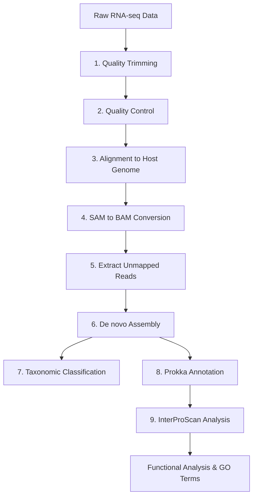

# N. americanus L3 Microbial Transcriptome Analysis Pipeline

A comprehensive bioinformatics pipeline for analyzing surface-sterilized *Necator americanus* L3 larval stage microbial transcriptome data to identify and functionally annotate microbial communities associated with hookworm development.

## Overview

This pipeline processes RNA-seq data from surface-sterilized *N. americanus* L3 larvae to:
1. Identify unmapped reads (potential microbial sequences)
2. Assemble microbial transcripts
3. Classify taxonomic composition
4. Annotate functional genes and pathways
5. Generate comprehensive GO term analysis

## Pipeline Workflow



## Prerequisites

### Software Requirements
- fastp (quality trimming)
- FastQC (quality control)
- BWA (alignment)
- samtools (BAM processing)
- MEGAHIT (de novo assembly)
- Kraken2 & Bracken (taxonomic classification)
- Prokka (gene annotation)
- InterProScan (functional annotation)

### Reference Files
- *N. americanus* reference genome: `MaSuRCA_config_purged_namericanus_withMito.short.masked.fasta`
- Kraken2 database (set via `$KRAKEN2_DB` environment variable)

### Input Files
- `NaL3_surfster_mRNA_S1_L001_R1_001.fastq.gz` (forward reads)
- `NaL3_surfster_mRNA_S1_L001_R2_001.fastq.gz` (reverse reads)

## Pipeline Scripts

### 1. Quality Trimming (`1_fastp.sh`)
**Purpose:** Remove low-quality sequences and adapters
- **Tool:** fastp
- **Resources:** 8 CPUs, 30G RAM, few minutes
- **Output:** Trimmed FASTQ files and QC reports

```bash
sbatch scripts/1_fastp.sh
```

### 2. Quality Control (`2_fastqc.sh`)
**Purpose:** Generate quality control metrics
- **Tool:** FastQC
- **Resources:** 4 CPUs, 25G RAM, few minutes
- **Output:** HTML QC reports

```bash
sbatch scripts/2_fastqc.sh
```

### 3. Host Genome Alignment (`3_sam.sh`)
**Purpose:** Align reads to *N. americanus* reference genome
- **Tool:** BWA-MEM
- **Resources:** 8 CPUs, 45G RAM, 4 hours
- **Output:** SAM alignment file

```bash
sbatch scripts/3_sam.sh
```

### 4. SAM to BAM Conversion (`4_bam.sh`)
**Purpose:** Convert and sort alignments, generate statistics
- **Tool:** samtools
- **Resources:** 4 CPUs, 50G RAM, few minutes
- **Output:** Sorted BAM files and alignment statistics

```bash
sbatch scripts/4_bam.sh
```

### 5. Extract Unmapped Reads (`5_unmapped_only.sh`)
**Purpose:** Extract reads that didn't align to host genome (potential microbial sequences)
- **Tool:** samtools
- **Resources:** 1 CPU, 15G RAM, few minutes
- **Output:** Unmapped FASTQ files for assembly

```bash
sbatch scripts/5_unmapped_only.sh
```

### 5b. Generate Summary Statistics (`5b_summary.sh`)
**Purpose:** Compile comprehensive pipeline statistics
- **Resources:** 1 CPU, 10G RAM, few minutes
- **Output:** Summary CSV, TSV, and detailed report

```bash
sbatch scripts/5b_summary.sh
```

### 6. De novo Assembly (`6_contigs.sh`)
**Purpose:** Assemble unmapped reads into contigs
- **Tool:** MEGAHIT
- **Resources:** 8 CPUs, 32G RAM, few minutes
- **Output:** Assembled contigs in FASTA format

```bash
sbatch scripts/6_contigs.sh
```

### 7. Taxonomic Classification (`7_kraken_bracken.sh`)
**Purpose:** Classify assembled contigs taxonomically
- **Tools:** Kraken2 + Bracken
- **Resources:** 8 CPUs, 50G RAM, few minutes
- **Output:** Taxonomic reports at genus and species levels

```bash
sbatch scripts/7_kraken_bracken.sh
```

### 8. Gene Annotation (`8_prokka_annotation.sh`)
**Purpose:** Annotate genes in assembled contigs
- **Tool:** Prokka
- **Resources:** 8 CPUs, 32G RAM, few minutes
- **Output:** GFF files with gene annotations

```bash
sbatch scripts/8_prokka_annotation.sh
```

### 9. Functional Annotation (`9_interproscan.sh`)
**Purpose:** Generate detailed functional annotations and GO terms
- **Tool:** InterProScan
- **Resources:** 6 CPUs, 20G RAM, few minutes
- **Output:** TSV file with GO terms and functional domains

```bash
sbatch scripts/9_interproscan.sh
```

## Directory Structure

```
namer_surface_ster_L3_pool_mRNA_transcript_data/
├── scripts/                          # Pipeline scripts
├── trimmed_reads/                     # Quality-trimmed FASTQ files
├── fastqc_results/                    # Quality control reports
├── sam_files/                         # Alignment files
├── bams_aligned/                      # BAM files and statistics
├── unmapped_fastq/                    # Unmapped reads for assembly
├── megahit_assembly/                  # Assembled contigs
├── kraken2_output/                    # Taxonomic classification
├── bracken_output/                    # Abundance estimates
├── prokka_annotation/                 # Gene annotations
│   └── NaL3_surfster_mRNA_prokka/
│       └── interproscan_output/       # Functional annotations
├── rna_seq_stats_summary.csv          # Pipeline statistics
└── rna_seq_detailed_report.txt        # Human-readable report
```

## Key Output Files

### Statistical Summaries
- `rna_seq_stats_summary.csv` - Machine-readable pipeline metrics
- `rna_seq_detailed_report.txt` - Human-readable processing report

### Assembly & Annotation
- `megahit_assembly/NaL3_surfster_mRNA.contigs.fa` - Assembled microbial contigs
- `prokka_annotation/*/NaL3_surfster_microbiome.gff` - Gene annotations
- `prokka_annotation/*/interproscan_output/interproscan_results.tsv` - GO terms and functional domains

### Taxonomic Analysis
- `kraken2_output/NaL3_surfster_mRNA.kraken2_contigs.report` - Taxonomic classification
- `bracken_output/NaL3_surfster_mRNA.bracken_contigs.G.report` - Genus-level abundances

## Running the Pipeline

### Sequential Execution
Submit jobs in order, waiting for each to complete:

```bash
# Quality processing
sbatch scripts/1_fastp.sh
sbatch scripts/2_fastqc.sh

# Alignment and processing
sbatch scripts/3_sam.sh
sbatch scripts/4_bam.sh
sbatch scripts/5_unmapped_only.sh
sbatch scripts/5b_summary.sh

# Assembly and annotation
sbatch scripts/6_contigs.sh
sbatch scripts/7_kraken_bracken.sh
sbatch scripts/8_prokka_annotation.sh
sbatch scripts/9_interproscan.sh
```

### Dependency-Based Execution
Use SLURM job dependencies for automated pipeline execution:

```bash
JOB1=$(sbatch --parsable scripts/1_fastp.sh)
JOB2=$(sbatch --parsable --dependency=afterok:$JOB1 scripts/2_fastqc.sh)
JOB3=$(sbatch --parsable --dependency=afterok:$JOB1 scripts/3_sam.sh)
JOB4=$(sbatch --parsable --dependency=afterok:$JOB3 scripts/4_bam.sh)
JOB5=$(sbatch --parsable --dependency=afterok:$JOB4 scripts/5_unmapped_only.sh)
JOB6=$(sbatch --parsable --dependency=afterok:$JOB4 scripts/5b_summary.sh)
JOB7=$(sbatch --parsable --dependency=afterok:$JOB5 scripts/6_contigs.sh)
JOB8=$(sbatch --parsable --dependency=afterok:$JOB7 scripts/7_kraken_bracken.sh)
JOB9=$(sbatch --parsable --dependency=afterok:$JOB7 scripts/8_prokka_annotation.sh)
JOB10=$(sbatch --parsable --dependency=afterok:$JOB9 scripts/9_interproscan.sh)
```

## Expected Results

### Assembly Statistics
- **Total contigs:** Variable (depends on microbial diversity)
- **Classification rate:** ~60-80% of contigs typically classified
- **Functional annotation:** Comprehensive GO terms and pathway information

### Functional Categories
Based on preliminary analysis, expect to find:
- **DNA replication & repair genes**
- **Metabolic pathway enzymes**
- **Stress response proteins**
- **Cell division machinery**
- **Transport systems**

### Taxonomic Composition
- Genus and species-level identification of microbial communities
- Abundance estimates for each taxonomic group
- Potential novel or unclassified sequences

## Troubleshooting

### Common Issues

1. **Reference file not found**
   - Ensure `$REFERENCEDIR` path is correct
   - Verify reference genome file exists

2. **Kraken2 database error**
   - Set `$KRAKEN2_DB` environment variable
   - Ensure database is properly installed

3. **InterProScan timeout**
   - Increase time limit if needed
   - Check available memory and CPU resources

4. **Empty output files**
   - Verify input file quality and size
   - Check log files for specific error messages

### Resource Optimization
- Adjust CPU/memory allocations based on cluster availability
- Monitor job efficiency and optimize resource requests
- Consider splitting large jobs if memory constraints occur

## Citation

When using this pipeline, please cite:
- The individual tools used (fastp, BWA, MEGAHIT, Kraken2, Prokka, InterProScan)
- Your study describing the *N. americanus* L3 microbial analysis
- Relevant database citations (GO, InterPro, etc.)

## Contact

For questions about this pipeline:
- Email: zpella@unmc.edu
- Lab: Fauver Lab, University of Nebraska Medical Center

## Version History

- v1.0: Initial pipeline implementation
- Optimized for SLURM-based HPC environments
- Designed for surface-sterilized *N. americanus* L3 analysis

---

*Last updated: August 27, 2025*
