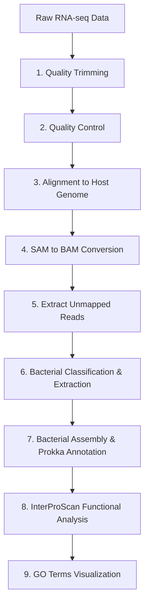

# N. americanus L3 Microbial Transcriptome Analysis Pipeline

A comprehensive bioinformatics pipeline for analyzing surface-sterilized *Necator americanus* L3 larval stage microbial transcriptome data to identify and functionally annotate bacterial communities associated with hookworm development.

## Overview

This pipeline processes RNA-seq data from surface-sterilized *N. americanus* L3 larvae to:
1. Identify unmapped reads (potential microbial sequences)
2. Classify and extract bacterial reads specifically
3. Assemble bacterial transcripts
4. Annotate functional genes and pathways
5. Generate comprehensive GO term analysis

## Pipeline Workflow



## Prerequisites

### Software Requirements
- fastp (quality trimming)
- FastQC (quality control)
- BWA (alignment)
- samtools (BAM processing)
- Kraken2 & Bracken (taxonomic classification)
- MEGAHIT (bacterial assembly)
- Prokka (gene annotation)
- InterProScan (functional annotation)

### Reference Files
- *N. americanus* reference genome: `MaSuRCA_config_purged_namericanus_withMito.short.masked.fasta`
- Kraken2 database (set via `$KRAKEN2_DB` environment variable)

### Input Files
- `NaL3_surfster_mRNA_S1_L001_R1_001.fastq.gz` (forward reads)
- `NaL3_surfster_mRNA_S1_L001_R2_001.fastq.gz` (reverse reads)

## Pipeline Scripts

### 1. Quality Trimming (`1_fastp.sh`)
**Purpose:** Remove low-quality sequences and adapters
- **Tool:** fastp
- **Resources:** 8 CPUs, 30G RAM, few minutes
- **Output:** Trimmed FASTQ files and QC reports

```bash
sbatch scripts/1_fastp.sh
```

### 2. Quality Control (`2_fastqc.sh`)
**Purpose:** Generate quality control metrics
- **Tool:** FastQC
- **Resources:** 4 CPUs, 25G RAM, few minutes
- **Output:** HTML QC reports

```bash
sbatch scripts/2_fastqc.sh
```

### 3. Host Genome Alignment (`3_sam.sh`)
**Purpose:** Align reads to *N. americanus* reference genome
- **Tool:** BWA-MEM
- **Resources:** 8 CPUs, 45G RAM, 4 hours
- **Output:** SAM alignment file

```bash
sbatch scripts/3_sam.sh
```

### 4. SAM to BAM Conversion (`4_bam.sh`)
**Purpose:** Convert and sort alignments, generate statistics
- **Tool:** samtools
- **Resources:** 4 CPUs, 50G RAM, few minutes
- **Output:** Sorted BAM files and alignment statistics

```bash
sbatch scripts/4_bam.sh
```

### 5. Extract Unmapped Reads (`5_unmapped_only.sh`)
**Purpose:** Extract reads that didn't align to host genome (potential microbial sequences)
- **Tool:** samtools
- **Resources:** 1 CPU, 15G RAM, few minutes
- **Output:** Unmapped FASTQ files for bacterial analysis

```bash
sbatch scripts/5_unmapped_only.sh
```

### 5b. Generate Summary Statistics (`5b_summary.sh`)
**Purpose:** Compile comprehensive pipeline statistics
- **Resources:** 1 CPU, 10G RAM, few minutes
- **Output:** Summary CSV, TSV, and detailed report

```bash
sbatch scripts/5b_summary.sh
```

### 6. Bacterial Classification & Extraction (`6_kraken_bracken_bacterial_pipeline.sh`)
**Purpose:** Comprehensive bacterial analysis pipeline
- **Tools:** Kraken2, Bracken, extract_kraken_reads.py
- **Resources:** 8 CPUs, 60G RAM, 15 hours
- **Steps:**
  1. Taxonomic classification of unmapped reads
  2. Extract bacterial reads specifically (taxid 2)
  3. Generate abundance reports at genus and species levels
  4. Filter reports for bacteria only
- **Output:** Bacterial reads for assembly, taxonomic reports, filtered abundance data

```bash
sbatch scripts/6_kraken_bracken_bacterial_pipeline.sh
```

### 7. Bacterial Assembly & Gene Annotation (`7_prokka_annotation.sh`)
**Purpose:** Assemble bacterial reads and annotate genes
- **Tools:** MEGAHIT, Prokka
- **Resources:** 8 CPUs, 32G RAM, 12 hours
- **Steps:**
  1. De novo assembly of bacterial reads into contigs
  2. Gene prediction and annotation with Prokka
- **Output:** Bacterial contigs and GFF gene annotations

```bash
sbatch scripts/7_prokka_annotation.sh
```

### 8. Functional Annotation (`8_interproscan_bacteria.sh`)
**Purpose:** Generate detailed functional annotations and GO terms
- **Tool:** InterProScan
- **Resources:** 6 CPUs, 20G RAM, 24 hours
- **Output:** TSV file with GO terms, functional domains, and pathway information

```bash
sbatch scripts/8_interproscan_bacteria.sh
```

### 9. Visualization (`9_visualize_go.py`)
**Purpose:** Create visualizations of GO term analysis
- **Tool:** Python with pandas, seaborn, matplotlib
- **Output:** Plots of top GO terms and functional categories

```bash
python scripts/9_visualize_go.py
```

## Directory Structure

```
namer_surface_ster_L3_pool_mRNA_transcript_data/
├── scripts/                               # Pipeline scripts
├── trimmed_reads/                         # Quality-trimmed FASTQ files
├── fastqc_results/                        # Quality control reports
├── sam_files/                             # Alignment files
├── bams_aligned/                          # BAM files and statistics
├── unmapped_fastq/                        # Unmapped reads
├── kraken2_output_unmapped_reads/         # Taxonomic classification
├── bracken_output_unmapped_reads/         # Abundance estimates
├── bracken_bacteria_filtered/             # Bacteria-only filtered reports
├── bacterial_reads_for_interproscan/      # Extracted bacterial reads
├── bacterial_assembly_TIMESTAMP/          # Bacterial contigs
├── bacterial_prokka_annotation_TIMESTAMP/ # Gene annotations
│   └── NaL3_surfster_bacterial_prokka/
│       └── interproscan_output/           # Functional annotations
├── rna_seq_stats_summary.csv              # Pipeline statistics
└── rna_seq_detailed_report.txt            # Human-readable report
```

## Key Output Files

### Statistical Summaries
- `rna_seq_stats_summary.csv` - Machine-readable pipeline metrics
- `rna_seq_detailed_report.txt` - Human-readable processing report

### Bacterial Analysis
- `bacterial_reads_for_interproscan/` - Extracted bacterial reads
- `bacterial_assembly_*/NaL3_surfster_bacterial.contigs.fa` - Assembled bacterial contigs
- `bacterial_prokka_annotation_*/NaL3_surfster_bacterial_prokka/*.gff` - Gene annotations
- `bacterial_prokka_annotation_*/NaL3_surfster_bacterial_prokka/interproscan_output/interproscan_results.tsv` - GO terms and functional domains

### Taxonomic Analysis
- `kraken2_output_unmapped_reads/NaL3_surfster_mRNA.kraken2_unmapped_reads.report` - Taxonomic classification
- `bracken_output_unmapped_reads/NaL3_surfster_mRNA.bracken_unmapped_reads.G.report` - Genus-level abundances
- `bracken_bacteria_filtered/` - Bacteria-only filtered abundance reports

## Running the Pipeline

### Sequential Execution
Submit jobs in order, waiting for each to complete:

```bash
# Quality processing and host alignment
sbatch scripts/1_fastp.sh
sbatch scripts/2_fastqc.sh
sbatch scripts/3_sam.sh
sbatch scripts/4_bam.sh
sbatch scripts/5_unmapped_only.sh
sbatch scripts/5b_summary.sh

# Bacterial analysis pipeline
sbatch scripts/6_kraken_bracken_bacterial_pipeline.sh
sbatch scripts/7_prokka_annotation.sh
sbatch scripts/8_interproscan_bacteria.sh

# Visualization
python scripts/9_visualize_go.py
```

### Dependency-Based Execution
Use SLURM job dependencies for automated pipeline execution:

```bash
JOB1=$(sbatch --parsable scripts/1_fastp.sh)
JOB2=$(sbatch --parsable --dependency=afterok:$JOB1 scripts/2_fastqc.sh)
JOB3=$(sbatch --parsable --dependency=afterok:$JOB1 scripts/3_sam.sh)
JOB4=$(sbatch --parsable --dependency=afterok:$JOB3 scripts/4_bam.sh)
JOB5=$(sbatch --parsable --dependency=afterok:$JOB4 scripts/5_unmapped_only.sh)
JOB6=$(sbatch --parsable --dependency=afterok:$JOB4 scripts/5b_summary.sh)
JOB7=$(sbatch --parsable --dependency=afterok:$JOB5 scripts/6_kraken_bracken_bacterial_pipeline.sh)
JOB8=$(sbatch --parsable --dependency=afterok:$JOB7 scripts/7_prokka_annotation.sh)
JOB9=$(sbatch --parsable --dependency=afterok:$JOB8 scripts/8_interproscan_bacteria.sh)
```

## Pipeline Rationale

This pipeline takes a **targeted bacterial approach** rather than general microbial assembly:

1. **Host read removal:** Standard alignment to remove *N. americanus* sequences
2. **Bacterial identification:** Kraken2 classifies unmapped reads taxonomically
3. **Bacterial extraction:** Only bacterial reads (taxid 2) are extracted for assembly
4. **Targeted assembly:** MEGAHIT assembles only the bacterial reads
5. **Bacterial annotation:** Prokka and InterProScan focus on bacterial gene function

This approach is more computationally efficient and biologically relevant for studying the bacterial microbiome of hookworm larvae.

## Expected Results

### Assembly Statistics
- **Bacterial contigs:** Variable (depends on bacterial diversity)
- **Classification rate:** ~60-80% of unmapped reads typically classified
- **Functional annotation:** Comprehensive GO terms and pathway information specific to bacteria

### Functional Categories
Based on bacterial microbiome analysis, expect to find:
- **DNA replication & repair genes**
- **Metabolic pathway enzymes**
- **Stress response proteins**
- **Cell division machinery**
- **Transport systems**
- **Antibiotic resistance genes**

### Taxonomic Composition
- Genus and species-level identification of bacterial communities
- Abundance estimates for each bacterial taxonomic group
- Potential novel or unclassified bacterial sequences

## Troubleshooting

### Common Issues

1. **Reference file not found**
   - Ensure `$REFERENCEDIR` path is correct
   - Verify reference genome file exists

2. **Kraken2 database error**
   - Set `$KRAKEN2_DB` environment variable
   - Ensure database is properly installed

3. **Bacterial read extraction fails**
   - Check that `extract_kraken_reads.py` script is executable
   - Verify taxid 2 (bacteria) exists in Kraken2 output

4. **InterProScan timeout**
   - Increase time limit if needed for large bacterial datasets
   - Check available memory and CPU resources

### Resource Optimization
- Adjust CPU/memory allocations based on cluster availability
- Monitor job efficiency and optimize resource requests
- The bacterial-focused approach reduces computational requirements compared to full metagenomic assembly

## Citation

When using this pipeline, please cite:
- The individual tools used (fastp, BWA, MEGAHIT, Kraken2, Prokka, InterProScan)
- Your study describing the *N. americanus* L3 bacterial microbiome analysis
- Relevant database citations (GO, InterPro, NCBI Taxonomy, etc.)

## Contact

For questions about this pipeline:
- Email: zpella@unmc.edu
- Lab: Fauver Lab, University of Nebraska Medical Center

## Version History

- v1.0: Initial pipeline implementation
- v2.0: Streamlined bacterial-focused workflow, removed general assembly step
- Optimized for SLURM-based HPC environments
- Designed for surface-sterilized *N. americanus* L3 bacterial microbiome analysis

---

*Last updated: September 2, 2025*
